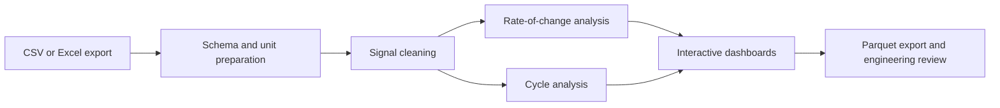

# CryoSens Analytics

[](https://github.com/zakilbaki/cryosens_analytics/actions/workflows/ci.yml)

Interactive Python toolkit for investigating rapid variations and operating cycles in
industrial temperature, pressure, and differential-pressure signals.

CryoSens turns raw sensor exports into a guided diagnostic workflow for engineers. It
focuses on transparent signal analytics: the user can inspect detected events, tune
thresholds, and compare sensors instead of receiving an unexplained anomaly score.

## Industrial use case

Rapid thermal or pressure changes can contribute to fatigue, material stress, and
equipment degradation. Finding these events manually across long multivariate time
series is slow and inconsistent. CryoSens provides reusable analyses for:

- rate-of-change event detection;
- threshold sensitivity studies;
- heating and cooling cycle characterization;
- cross-sensor event coincidence;
- interactive visual diagnostics.

This repository is an analytics and decision-support toolbox. It does not claim to
predict equipment failure, and detected events still require domain validation.

## Workflow



| Module | Responsibility |
| --- | --- |
| `io` | Scriptable and file-picker based CSV/Excel loading |
| `preprocessing` | Column selection, missing values, renaming, unit conversion |
| `analysis.roc` | Rapid-variation detection, statistics, sensitivity, coincidence |
| `analysis.cycle` | Adaptive thermal-cycle detection and cycle summaries |
| `visualisation` | Plotly and notebook dashboards |
| `save_load` | Reproducible Parquet exports |

## Data contract

The standard workflow expects one time column and one or more numeric sensor columns:

```text
time,temperature_c,pressure_bar
2026-01-01T00:00:00,20.0,4.20
2026-01-01T00:01:00,20.4,4.21
```

A small synthetic file is available at `examples/sample_sensor_data.csv`. It is provided
only to verify the loading workflow; it is not production or customer data.

## Quick start

Requirements: Python 3.10+ and [uv](https://docs.astral.sh/uv/).

```bash
uv sync --extra dev
uv run python examples/quickstart.py
uv run jupyter notebook notebooks/main.ipynb
```

The loader can also be used without the notebook UI:

```python
from cryosens.io.loader import load_data

sensor_data = load_data("measurements.csv")
```

The notebook exposes the guided workflow through the public API:

```python
from cryosens.api import (
    launch_cycle_dashboard,
    launch_event_coincidence_heatmap,
    launch_roc,
    load_raw_data,
    run_preprocessing_pipeline,
)
```

See [`user_guide.pdf`](user_guide.pdf) for the end-user walkthrough.

## Repository structure

```text
src/cryosens/       reusable package
notebooks/          guided analysis entry point
examples/           synthetic input and scriptable quick start
tests/              loading, units, and persistence tests
user_guide.pdf      analyst-facing documentation
```

## Validation and quality

```bash
uv sync --extra dev
uv run pytest -q
```

GitHub Actions runs the test suite on every pull request. The tests cover data loading,
unit labels, and Parquet persistence; the event thresholds and detected cycles must be
validated against equipment context and engineering acceptance criteria.

